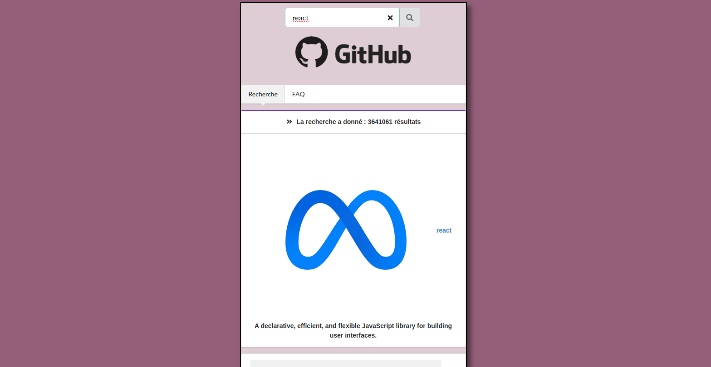

# GitHub moteur de recherche : 

**Amusez-vous en recherchant tout ce qu'il vous passe par la tête à l'aide de l'API github! En anglais, en français... sur les sujets que vous souhaitez !**
```
https://github-moteur-de-recherche.netlify.app/
```

## Utilisation


Sur la page recherche, complétez le champ de recherche et valider la recherche.
Des résultats seront fournis grâce à des listes de depôts github en fonction de votre recherche.


## Tecnhos utilisées


 REACT.JS

 Consommation de l'API à l'aide d'Axios

 CSS : fait main + Semantic-ui 

## Résultat

<article> 
 
</article>      
  
<br>   


<article> 
 
</article>
  


